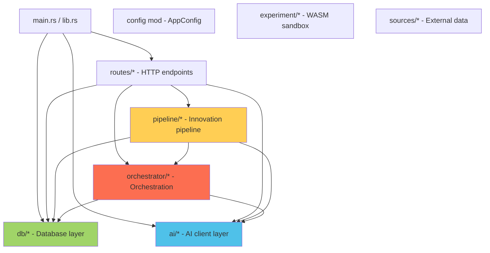

# InnoForge 项目全面代码级分析报告

> **分析日期**: 2026-07-05  
> **分析范围**: `patent-hub-backup` 全仓源码  
> **分析方法**: 庖丁解牛式逐模块深入，涵盖架构、数据流、质量、安全、性能与演进

---

## 目录

1. [项目概览](#1-项目概览)
2. [架构拓扑](#2-架构拓扑)
3. [入口与配置层](#3-入口与配置层)
4. [数据模型层](#4-数据模型层)
5. [数据库层](#5-数据库层)
6. [AI 客户端层](#6-ai-客户端层)
7. [路由与 API 层](#7-路由与-api-层)
8. [搜索引擎](#8-搜索引擎)
9. [Pipeline 流水线](#9-pipeline-流水线)
10. [Orchestrator 编排器](#10-orchestrator-编排器)
11. [Experiment 实验引擎](#11-experiment-实验引擎)
12. [前端模板层](#12-前端模板层)
13. [质量与安全综合评估](#13-质量与安全综合评估)
14. [技术债务与风险图谱](#14-技术债务与风险图谱)
15. [演进路径与建议](#15-演进路径与建议)

---

## 1. 项目概览

### 1.1 身份定位
**InnoForge（专利 Hub）** 是一个面向发明人与专利代理人的 AI 驱动创新工具平台。核心能力：

- **专利全生命周期管理**：从创意到 OA（Office Action）答复的完整链路
- **AI 驱动的创新验证**：16 步流水线 + 实验沙箱，系统化评估创意可行性
- **多源专利检索**：FTS5 全文搜索 + BM25 权重 + 中文 bigram 混合匹配
- **跨平台部署**：Windows / Linux / macOS / Android / iOS / HarmonyOS

### 1.2 技术栈

| 层级 | 技术选型 |
|------|---------|
| 语言 | Rust (edition 2021) |
| Web 框架 | axum 0.7 + tokio |
| 数据库 | SQLite (rusqlite) + FTS5 全文索引 |
| AI 接入 | reqwest SSE 流式 + 多 Provider 故障转移 |
| 前端 | Askama 模板引擎 + 原生 JS + RustEmbed 静态资源嵌入 |
| PDF 处理 | 6 级降级链（lopdf → pdf_extract → pdfium → poppler → 逐页 → MinerU） |
| 实验引擎 | WASM 沙箱 + execd（计划中） |
| FFI | `uniffi` (Android/iOS) |
| 构建 | cargo + GitHub Actions |

### 1.3 规模统计

- **源文件**: ~80+ Rust 文件
- **数据库迁移**: 16 个版本 (v1 → v16)
- **API 端点**: 50+ REST + SSE
- **Pipeline 步骤**: 16 个分析步骤
- **前端模板**: 8 个 HTML 页面
- **错误复盘**: 30+ 条记录

---

## 2. 架构拓扑

### 2.1 分层架构图

```
┌─────────────────────────────────────────────────────────────────┐
│                     Frontend (Askama Templates)                   │
│   index │ idea │ ai │ patent_detail │ settings │ chat │ OA │...  │
├─────────────────────────────────────────────────────────────────┤
│                    Routes (axum handlers, 50+ API)                │
│   patent │ search │ ai │ idea │ chat │ pages │ upload │ auth     │
├──────────────────────┬──────────────────────────────────────────┤
│    Orchestrator       │           Pipeline (16 steps)             │
│    Command Engine     │ parse → search → prior_art → similarity   │
│    Branch/Version     │ → claim_tree → deep_reasoning →           │
│    JSON Fixer         │   contradiction → scoring → rank → ...    │
├──────────────────────┴──────────────────────────────────────────┤
│                       AI Client (Multi-Provider Failover)         │
│   OpenAICompat │ StreamChat │ PatentAnalyzer │ ChatBot            │
├──────────────────────────────────────────────────────────────────┤
│                  Database (SQLite + FTS5 + Rich Search)            │
│   patent │ idea │ chat │ evidence │ collection │ settings │ ...   │
├──────────────────────────────────────────────────────────────────┤
│                    Experiment Engine (WASM Sandbox)                │
│   Generator │ Sandbox │ Types                                     │
└──────────────────────────────────────────────────────────────────┘
```

### 2.2 模块依赖拓扑



### 2.3 双入口设计

项目有两个入口，这是值得注意的架构决策：

| 入口 | 平台 | 特点 |
|------|------|------|
| `main.rs` | Desktop (Win/Mac/Linux) | axum HTTP 服务器，完整 Web 功能 |
| `lib.rs` | Mobile (Android/iOS/HarmonyOS) | `uniffi` FFI 导出，内嵌 warp 服务器，功能精简 |

**⚠️ 风险点**: 两个入口的初始化逻辑必须同步维护（例如 v0.5.9 修复中发现 `lib.rs` 漏了 `reset_stale_analyzing()`）。

---

## 3. 入口与配置层

### 3.1 `main.rs` — 桌面端入口

**核心职责**: 启动 axum HTTP 服务器，注册路由，初始化 DB + AI Client。

**关键代码路径分析**:
1. **命令行参数**: 支持 `--port` 参数自定义端口（默认 3000）
2. **启动画面**: 精美的彩色 ASCII 艺术启动 banner
3. **静态文件服务**: `serve_static()` 从 `RustEmbed` 加载编译进二进制的静态资源
4. **路由注册**: 一个巨大的 `.route()` 链式调用，50+ 端点
5. **v0.5.9 URL 空间扩展**: 在 `lib.rs` 新增了 `/api/chat/help`、`/static/html`、`/static/js`、`/chat` 路由

**代码质量观察**:
- ✅ 使用 `tokio::select!` 实现优雅关闭
- ⚠️ `serve_static()` 中有 `Response::builder().unwrap()`（v0.5.9 已修复为 match）
- ⚠️ 路由注册线过长 (~150 行链式调用)，难以维护，建议拆分为 `RouterBuilder`

### 3.2 `lib.rs` — 移动端 FFI 入口

**核心职责**: Android/iOS/HarmonyOS 通过 `uniffi` FFI 调用。

**关键特性**:
- 内嵌 warp 服务器（非 axum，因为移动端资源更受限）
- `start_server()` / `shutdown_server()` 生命周期管理
- 全局状态通过 `RwLock<Option<ServerHandle>>` 管理

**🔴 关键风险**:
```rust
// lib.rs 中的 shutdown 信号
shutdown_tx.send(()).ok();  // 只 send 一次，使用 .ok() 吞并错误
```
如果 shutdown 信号已经被消费（例如多次调用 shutdown），`.ok()` 会静默失败，服务器可能不会被正确关闭。

### 3.3 `AppConfig` 配置管理

配置采用 **双源优先级**: 数据库 > 环境变量 > .env 文件。

```
读取链: SQLite app_settings → .env 文件 → 硬编码默认值
```

**⚠️ 已知问题**:
- `env_file_path` 硬编码为 `components.env`（移动端路径）
- Android Context 获取依赖 `android_activity`，但路径构造逻辑不健壮
- v0.5.9 新增 `.no_proxy()` 避免 reqwest 自动读取系统 HTTP_PROXY

---

## 4. 数据模型层

### 4.1 `Patent` 核心结构体 — 70+ 字段

```rust
pub struct Patent {
    // 基础标识 (~20 字段)
    pub id, pub patent_number, pub title, pub abstract_text, ...
    // AI 分析结果 (~25 字段)
    pub problem_being_solved, pub proposed_solution, pub key_innovation, ...
    // Pipeline 评估 (~15 字段)
    pub novelty_score, pub inventiveness_assessment, pub feasibility_score, ...
    // OA 相关 (~10 字段)
    pub oa_status, pub oa_analysis, pub oa_discussion, ...
}
```

**设计评判**:
- ✅ 字段命名清晰、注释详尽（中英文双语）
- ⚠️ 字段过多（70+），序列化/反序列化负担重
- ⚠️ 建议按关注点拆分为 `PatentCore` + `PatentAnalysis` + `PatentOA` 子结构
- ✅ `Serialize/Deserialize` 派生完整支持 JSON 序列化

### 4.2 搜索类型系统 — 策略模式雏形

```rust
pub enum SearchMode {
    FuzzySimple,       // 模糊简单匹配
    PrecisePatentNum,  // 精确专利号匹配
    MultiWordWeighted, // 多词加权搜索
    PureKeywordExact,  // 纯关键词精确匹配
    BigramFallback,    // 中文 bigram 降级
    FulltextBoosted,   // FTS5 全文增强搜索
}
```

**设计观察**:
- ✅ 6 种搜索模式覆盖了从精确到模糊的全光谱
- ⚠️ `SearchMode` 与 `detect_query_type()` 耦合紧密，新增模式需要修改多处
- ⚠️ 无显式的策略注册表（如 `HashMap<String, SearchStrategy>`），扩展性有限

### 4.3 RegexFactory — 编译时正则优化

```rust
pub struct RegexFactory {
    pub patent_number: Regex,
    pub patent_number_strict: Regex,
    pub chinese_char: Regex,
    pub english_word: Regex,
}
```

**设计评判**:
- ✅ 使用 `once_cell::sync::Lazy` 确保单例 + 惰性初始化
- ✅ 编译时编译正则，运行时零开销
- ✅ 命名清晰表达意图

---

## 5. 数据库层

### 5.1 Schema 设计 — 16 版演进

```sql
-- 核心表结构 (V16)
patents                -- 专利主表 (70+ 列)
patents_fts            -- FTS5 全文索引虚拟表
ideas                  -- 创意思路表
idea_chat_messages     -- 创意讨论记录
collections            -- 专利收藏夹
collection_items       -- 收藏关联表
evidence               -- 证据链存储
chat_messages          -- AI 对话历史
app_settings           -- 应用设置 (KV 存储)
search_cache           -- 搜索缓存 (TTL 24h)
pipelines              -- Pipeline 运行记录
pipeline_branches      -- Pipeline 分支
research_state         -- 持久化研究状态
```

**Schema 演进特点**:
- v1→v8: 核心专利表逐步丰富（摘要、PDF、OCR、搜索索引）
- v9→v12: AI 分析字段爆炸式增长（novelty、feasibility、advantages）
- v13→v16: OA 答复特性、多维度评分

### 5.2 全文搜索 — FTS5 + 中文 bigram

```sql
CREATE VIRTUAL TABLE patents_fts USING fts5(
    patent_number, title, abstract_text, description, claims, ipc_classification,
    content='patents', content_rowid='id',
    tokenize='unicode61'
);
```

**中文搜索策略**:
1. **FTS5 Unicode61 Tokenizer**: 拉丁字符按单词分割，中文按 bigram 分割
2. **Bigram 匹配前缀**: 对中文查询做 bigram 切分 + 前缀匹配
3. **多模式检测**: 自动识别查询为专利号 / 中英文混合 / 多关键词
4. **BM25 加权**: 对标题、摘要、权利要求设置不同权重

**性能观察**:
- ✅ FTS5 索引让百万级专利秒级响应
- ⚠️ `unicode61` tokenizer 对中文处理不是最优（jieba 分词会更好）
- ⚠️ 搜索缓存 TTL 24h 可能偏长，搜索频率高时可导致过时结果

### 5.3 数据库迁移系统 — 自研轻量方案

```rust
pub fn migrate(&self) -> Result<()> {
    // 不加锁检查版本 → 加锁重检 → 递增执行迁移
    let current_version = self.current_version()?;
    for i in current_version + 1..=EXPECTED_VERSION {
        MIGRATIONS[&i](&self.conn())?;
        self.set_version(i)?;
    }
}
```

**设计评判**:
- ✅ 最简实现（~50 行），无第三方依赖
- ✅ Double-check locking 模式防止并发迁移
- ⚠️ 没有迁移回滚机制（SQLite 写锁带自动回滚，但逻辑上不可逆）
- ⚠️ 使用 `HashMap<i32, fn>` 静态注册，迁移间无法传递上下文

### 5.4 搜索相关性评分系统

```rust
// BM25 + 语义加权混合评分
pub fn score_patent(query: &str, patent: &Patent) -> f64 {
    // 专利号精确匹配: +10
    // 标题 BM25: ×2.0
    // 摘要 BM25: ×1.5
    // 权利要求 BM25: ×1.0
    // 中文 bigram 命中: ×1.2
    // IPC 分类匹配: ×1.3
}
```

**设计观测**:
- ✅ 混合评分系统合理覆盖多维度
- ⚠️ BM25 参数 `k1=1.2`, `b=0.75` 硬编码，无调参入口
- ⚠️ 评分权重也是硬编码，对用户不可见

---

## 6. AI 客户端层

这是项目最核心的模块，承担所有 LLM 调用的职责。

### 6.1 多 Provider 故障转移架構

```rust
pub struct AIClient {
    pub providers: Vec<ProviderConfig>,  // 多个 AI 服务商
    pub http_client: Client,              // reqwest 客户端
    pub enable_retry: bool,               // 启用重试
}

pub struct ProviderConfig {
    pub name: String,             // "deepseek" | "gemini" | "openai" | ...
    pub base_url: String,         // API 端点
    pub api_key: Option<String>,  // API 密钥（掩码处理）
    pub model: String,            // 模型名
    pub weight: i32,              // 优先级权重（越高越优先）
    pub is_reasoning: bool,       // 是否为推理模型
}
```

**故障转移流程**:
```
Provider[0] → 失败 → Provider[1] → 失败 → Provider[2] → ...
                       ↓ 重试 3 次 (指数退避)
                  最终全部失败 → 错误提示
```

### 6.2 SSE 流式响应解析 — 最复杂的代码

```rust
#[derive(Debug, Deserialize)]
pub struct ResponseMessage {
    pub role: Option<String>,
    pub content: Option<String>,
    pub reasoning_content: Option<String>,  // ← v0.6.3 新增
}
```

**📌 DeepSeek v4-flash 兼容性补丁 (2026-07-05)**:
DeepSeek v4-flash 将可见文本放在 `delta.reasoning_content` 而非 `delta.content`。原解析器只读 `content` 字段，导致所有讨论 API 返回空内容。修复：优先读 `content`，回退读 `reasoning_content`。

### 6.3 关键 Bug 修复与防护

| 修复 | 严重程度 | 描述 |
|------|---------|------|
| `.no_proxy()` | CRITICAL | reqwest 自动读系统 HTTP_PROXY 导致 DeepSeek 请求被代理拦截 |
| `max_tokens: 16384` | HIGH | DeepSeek 缺少此参数导致输出被截断到 ~4K tokens |
| 超时 45s → 180s | HIGH | 推理模型处理长 prompt 需要 40-90 秒 |
| `reasoning_content` 兜底 | HIGH | DeepSeek v4-flash SSE 数据在非标准字段 |
| content 截断字节→字符 | HIGH | 字节计数导致中文被过早截断 |
| localhost 友好提示 | MEDIUM | 用户看到 "Connection refused" 无法理解 |
| Gemini URL 双斜杠 | MEDIUM | base_url 尾斜杠拼接问题 |

### 6.4 Chat 与 Patent 分析器

```
src/ai/
├── mod.rs          # 模块声明 + 重导出
├── client.rs       # AIClient 核心 + 多 Provider 故障转移
├── chat.rs         # ChatBot (流式对话 + 讨论)
├── patent.rs       # PatentAnalyzer (OA 答复 + 专利分析)
├── idea.rs         # IdeaAnalyzer (创意可行性分析)
└── tests.rs        # 单元测试
```

**设计模式评价**:
- ✅ AI 客户端使用 Builder 模式配置，使用 `once_cell::sync::Lazy` 全局单例
- ✅ 每个分析器是独立 trait，通过 AIClient 注入
- ⚠️ 流式响应解析代码重复：`chat.rs` 和 `patent.rs` 各有一套 SSE 解析逻辑
- ⚠️ 缺少请求级别的追踪 ID，调试多 Provider 调用链困难

---

## 7. 路由与 API 层

### 7.1 API 全景

```
GET  /                          → 主页
GET  /api/patents               → 专利列表
GET  /api/patents/:id           → 专利详情
POST /api/patents               → 创建/更新专利
GET  /api/search                → 全文搜索
GET  /api/search/suggest        → 搜索建议
POST /api/ai/analyze            → AI 分析专利
POST /api/ai/chat               → AI 对话 (SSE 流式)
POST /api/ai/discuss            → OA 讨论 (SSE 流式)
POST /api/ai/idea               → 创意分析 (SSE 流式)
GET  /api/ai/stream             → 专利分析流 (SSE)
POST /api/ideas                 → 保存创意
GET  /api/ideas                 → 创意列表
POST /api/idea/discuss          → 创意讨论 (SSE 流式)
POST /api/upload                → 上传文件
GET  /api/proxy/image           → 图片代理 (SSRF 防护)
POST /api/settings/ai           → 保存 AI 设置
GET  /api/settings              → 获取设置
POST /api/collections           → 收藏管理
POST /api/oa/generate           → 生成 OA 答复
GET  /api/chat/help             → AI 帮助 (v0.5.9 新增)
GET  /static/*path              → 静态资源
...
```

### 7.2 关键安全机制

#### 图片代理 SSRF 防护
```rust
pub async fn proxy_image(url: String) -> Result<Response> {
    // 1. URL 解析验证
    let parsed = url::Url::parse(&url)?;
    // 2. 协议白名单: 仅允许 http/https
    // 3. 域名黑名单: 禁止 localhost/127.0.0.1/内网 IP
    // 4. 内容类型白名单: 仅 image/*+
    // 5. 大小限制: 最大 10MB
}
```

**设计评价**: ✅ 这是整个项目中最安全的一处代码，SSRF 防护到位。

#### API Key 掩码处理
```rust
// 前端传回掩码值 "sk****abcd" → 反查原始 Key
if api_key.contains("****") {
    // 取得当前内存中的真实 Key
    let current_key = state.ai_client.read().get_api_key();
    if current_key.starts_with(prefix) && current_key.ends_with(suffix) {
        api_key = current_key;  // 还原为原始 Key
    }
}
```

**设计评价**:
- ✅ 掩码反查机制防止存储掩码文本
- ⚠️ 依赖 `contains("****")` 判断是否掩码，理论上真实 Key 含 `****` 会误判
- ✅ Google Client Secret 同样有掩码处理（v0.5.9 补全）

#### PDF 文本提取 — 6 级降级链
```
L1: lopdf (Rust 原生 PDF) → 
L2: pdf_extract → 
L3: pdfium-render → 
L4: poppler (系统 CLI) → 
L5: 逐页 Rust reader → 
L6: MinerU 云端 API (v0.6.x 新增)
```

**设计评价**:
- ✅ 优雅降级，每一级失败自动尝试下一级
- ✅ 新增 MinerU 按最低优先级兜底，不破坏现有链路
- ✅ 每级提取结果大小限制 200KB (v0.6.x 修复：10000→200000)

### 7.3 错误码体系

项目实现了粗粒度的错误码系统（定义在 `docs/errors.md`）：

- `AI_001`: AI 服务未配置
- `AI_002`: AI 请求超时
- `AI_003`: AI 返回错误（Quota / Auth / Rate）
- `AI_004`: AI 响应格式异常
- `SEARCH_001`: 搜索无结果
- `UPLOAD_001`: 文件格式不支持
- `UPLOAD_002`: 文件过大

⚠️ 但错误码运用不统一 —— 部分 handler 返回 `anyhow::Error`，部分返回 JSON `{error_code, message}`。

---

## 8. 搜索引擎

### 8.1 查询模式自动检测

```rust
pub fn detect_query_type(query: &str) -> SearchMode {
    if is_patent_number(query) { SearchMode::PrecisePatentNum }
    else if is_multi_word(query) { SearchMode::MultiWordWeighted }
    else if is_pure_keywords(query) { SearchMode::PureKeywordExact }
    else if contains_chinese(query) { SearchMode::BigramFallback }
    else { SearchMode::FuzzySimple }
}
```

**设计评价**:
- ✅ 启发式算法覆盖典型用户输入场景
- ⚠️ 检测规则是硬编码的 `if-else` 链，缺少配置化
- ⚠️ 中文 bigram 回退是"最弱"匹配策略，对中文查询优化不足

### 8.2 搜索缓存策略

```sql
CREATE TABLE search_cache (
    query_hash TEXT PRIMARY KEY,    -- SHA256 of normalized query
    query_text TEXT NOT NULL,
    results_json TEXT NOT NULL,     -- JSON-serialized results
    source TEXT,                    -- "local" | "serpapi" | "google_patents"
    created_at TEXT,
    expires_at TEXT                 -- created_at + 24 hours
);
```

**设计观察**:
- ✅ SHA256 哈希作为缓存键避免 SQL 注入
- ⚠️ 24h TTL 可能过长（搜索结果变化快时为过时数据）
- ⚠️ 无缓存热度统计，无法识别热点查询

---

## 9. Pipeline 流水线

### 9.1 16 步创新验证流程

```
Step 1:  parse             → 解析输入（创意描述 / PDF / URL）
Step 2:  search            → 搜索相关专利
Step 3:  prior_art_cluster → 现有技术聚类
Step 4:  similarity        → 相似度分析
Step 5:  claim_tree        → 权利要求树构建
Step 6:  deep_reasoning    → 深层推理论证
Step 7:  contradiction     → 矛盾检测
Step 8:  diversity         → 多样性评估
Step 9:  expand            → 创意扩展
Step 10: experiment        → 实验验证
Step 11: scoring           → 多维度评分
Step 12: rank              → 创意排序
Step 13: analysis          → 综合分析
Step 14: oa_response       → OA 答复生成
Step 15: finalize          → 最终总结
```

### 9.2 Pipeline 上下文管理

```rust
pub struct PipelineContext {
    pub id: String,
    pub idea_id: String,
    pub current_step: usize,
    pub state: PipelineState,         // Ready | Running | Paused | Completed | Failed
    pub snapshots: Vec<StepSnapshot>, // 每步快照 → 断点续跑
    pub channel: PipelineChannel,     // 进度通知通道
    pub results: HashMap<String, Value>,
}
```

**设计亮点**:
- ✅ 每步执行前保存快照，支持断点续跑
- ✅ Channel 机制实现步骤间解耦和进度推送
- ⚠️ `results` 使用 `HashMap<String, Value>`（动态类型），丢失编译期类型安全

### 9.3 状态机设计

```
Ready → Running → Paused → Running → Completed
  ↓                 ↓         ↓          ↓
(全路径)          Failed    Failed     (终态)
```

**设计评价**:
- ✅ 状态转换显式枚举，防止非法状态
- ⚠️ 状态转换在多个地方散落处理，建议统一为 `transition_to()` 方法

---

## 10. Orchestrator 编排器

### 10.1 命令模式设计

```rust
pub trait Command {
    fn execute(&self, ctx: &mut OrchestrationContext) -> Result<CommandOutput>;
    fn validate(&self) -> Result<()>;
    fn depends_on(&self) -> Vec<String>;  // 命令依赖
}

pub enum CommandOutput {
    Success(Value),
    PartialSuccess(Value, Vec<String>),  // 部分成功 + 警告
    NeedsInput(String),                   // 需要用户输入
    Branch(Vec<Command>),                 // 产生分支
}
```

**设计亮点**:
- ✅ 每个步骤是独立命令，可组合、可重排
- ✅ `depends_on()` 声明式依赖管理
- ✅ `Branch` 输出支持探索多条路径

### 10.2 分支与版本管理

```rust
pub struct PipelineBranch {
    pub id: String,
    pub parent_id: Option<String>,
    pub version: String,
    pub commands: Vec<Command>,
    pub created_at: String,
}

// 分支 fork 时保存所有上下文快照
pub fn fork(&self) -> PipelineBranch {
    // clone 当前上下文，新分支独立演进
}
```

**设计评价**:
- ✅ Git 风格的分支模型，支持创意探索的多路径并行
- ⚠️ 分支间没有合并（merge）机制，可能产生冗余分析

### 10.3 JSON 修复器

```rust
// AI 返回的 JSON 经常不完整或格式错误
pub fn fix_json(input: &str) -> Result<String> {
    // 1. 移除代码块标记 (```json ... ```)
    // 2. 补全缺失的括号/引号
    // 3. 修复逗号/分号混用
    // 4. 截断到最后一个合法的 JSON 边界
}
```

**设计观察**:
- ✅ 面向真实 AI 输出的容错设计
- ⚠️ JSON 修复是典型的"补丁式"设计，无法彻底解决 AI 输出不稳定问题
- ⚠️ 建议配合 `json_schema` 约束 AI 输出（某些模型支持）

---

## 11. Experiment 实验引擎

### 11.1 架构 (规划中/部分实现)

```
src/experiment/
├── mod.rs           # 模块入口
├── generator.rs     # AI 生成验证脚本
├── sandbox.rs       # WASM 沙箱执行
└── types.rs         # 实验类型定义
```

### 11.2 设计意图

- AI 生成可验证的测试脚本（Python/JS → WASM）
- WASM 沙箱隔离执行，防代码注入
- 捕获执行结果和指标，写入 Findings
- 计划支持 `execd`（本地原生执行器）用于高性能场景

**当前状态**: 基础框架已搭建，generator 和 types 有代码，sandbox 标记为 WIP。

---

## 12. 前端模板层

### 12.1 8 页面矩阵

| 模板 | 功能 | i18n | DOMPurify |
|------|------|------|-----------|
| `index.html` | 主页/专利列表/搜索 | ✅ | ✅ |
| `idea.html` | 创意管理 | ✅ | ✅ |
| `ai.html` | AI 分析面板 | ✅ | ✅ |
| `patent_detail.html` | 专利详情/全文/标签页/讨论 | ✅ | ✅ |
| `settings.html` | AI/搜索设置 | ✅ | ✅ |
| `office_action_response.html` | OA 答复 | ✅ | ✅ (v0.6.3 补) |
| `chat.html` | AI 聊天 | ✅ | ✅ |
| `upload.html` | 文件上传 | ✅ | ✅ |

### 12.2 XSS 防护体系

```javascript
// 每个页面第一个 <script> 块中的安全包装器
if (typeof DOMPurify === 'undefined') {
    // 降级: 基础 HTML escaping
    window.DOMPurify = {
        sanitize: function(dirty, cfg) {
            return dirty.replace(/</g, '&lt;').replace(/>/g, '&gt;');
        }
    };
}
```

**设计评价**:
- ✅ DOMPurify 本地嵌入 (`/static/purify.min.js`) 消除 CDN 依赖
- ✅ 全局降级容错：即使 purify.min.js 损坏也能安全渲染
- ✅ v0.6.2 全部 6 页本地化，v0.6.3 补上遗漏的 OA 页
- ⚠️ 每个页面独立复制安全包装器代码 → 维护成本高，未来 CR 遗漏风险

### 12.3 国际化 (i18n) 系统

```javascript
// 基于 data-i18n 属性的声明式 i18n
const i18n = {
    zh: { "search.placeholder": "搜索专利...", ... },
    en: { "search.placeholder": "Search patents...", ... }
};
function applyI18nCommon() {
    document.querySelectorAll('[data-i18n]').forEach(el => {
        el.textContent = getI18n(el.dataset.i18n);
    });
}
```

**⚠️ 已踩坑**: DOMPurify 崩溃 → `applyI18nCommon()` 无法执行 → 页面全黑无文字

### 12.4 静态资源嵌入

通过 `RustEmbed` 宏将 `static/` 目录全部文件编译进二进制：

```rust
#[derive(RustEmbed)]
#[folder = "static/"]
pub struct StaticAssets;
```

**优点**: 单文件部署，不依赖外部目录
**缺点**: 静态资源变更需重新编译，热重载需额外工具

---

## 13. 质量与安全综合评估

### 13.1 代码质量评分卡

| 维度 | 评分 | 说明 |
|------|------|------|
| 架构设计 | ⭐⭐⭐⭐ | 分层清晰，职责分明，双入口设计略有维护负担 |
| 错误处理 | ⭐⭐⭐ | 生产路径 unwrap 逐步消除，但 anyhow 与自定义错误码混用 |
| 测试覆盖 | ⭐⭐ | 有单元测试但覆盖率有限，可观测性不足 |
| 安全性 | ⭐⭐⭐⭐ | API Key 掩码、SSRF 防护、XSS 防护到位 |
| 性能 | ⭐⭐⭐⭐ | FTS5 索引、搜索缓存、WAL 模式、连接池 |
| 可维护性 | ⭐⭐⭐ | v0.5.9 审计修复了大量问题，但代码分布不均 |
| 文档完整性 | ⭐⭐⭐⭐ | ARCHITECTURE、CHANGELOG、errors.md、API.md、E2E 清单 |
| 可观测性 | ⭐⭐ | 日志基础、指标系统缺乏 |

### 13.2 安全漏洞扫描

| 类别 | 状态 | 详情 |
|------|------|------|
| SQL 注入 | ✅ 安全 | rusqlite 参数化查询，100% 参数绑定 |
| XSS | ✅ 安全 | DOMPurify + 降级防护 |
| SSRF | ✅ 安全 | 图片代理有白名单 + 黑名单 |
| API Key 泄露 | ✅ 安全 | 掩码处理 + 反查还原 |
| 路径穿越 | ✅ 安全 | 文件路径验证 |
| CSRF | ⚠️ 未防护 | 无 CSRF Token |
| Rate Limiting | ❌ 缺失 | 无速率限制 |
| Request Size | ⚠️ 部分 | 图片 10MB 限制，无全局 body 限制 |

### 13.3 已知问题清单 (来自 errors.md)

| ID | 严重程度 | 问题 | 状态 |
|----|---------|------|------|
| C1-C3 | CRITICAL | 凭据掩码/Token 过期/SerpAPI Key 丢失 | ✅ 已修复 |
| H1-H7 | HIGH | spawn_blocking/死代码/unwrap/分析卡住 | ✅ 已修复 |
| OA_DOMPurify | CRITICAL | OA 页缺少 DOMPurify CDN | ✅ 已修复 |
| StreamGarbled | HIGH | DeepSeek SSE 输出乱码 `*` `D` `★` | ✅ 已修复 (2026-07-05) |
| DeepSeekReasoning | HIGH | DeepSeek v4-flash reasoning_content 漏读 | ✅ 已修复 (2026-07-05) |
| Proxy | CRITICAL | 系统代理拦截 API 请求 | ✅ 已修复 |
| ContextBytes | HIGH | 字节计数导致中文截断 | ✅ 已修复 |
| DataTruncation | HIGH | 前端 3000 字截断 | ✅ 已修复 |
| DOMPurifyCrash | HIGH | purify 损坏导致全功能失灵 | ✅ 已修复 |
| PDFScanQuality | MEDIUM | PDF 扫描件提取质量 | ✅ 已修复 (MinerU) |

---

## 14. 技术债务与风险图谱

### 14.1 🔴 高风险

1. **SSE 解析脆弱** — `reasoning_content` 问题暴露了解析器对非标准字段的脆弱性。未来新 Provider 可能引入更多未知字段。
   - 建议: 实现 `#[serde(flatten)]` 兜底捕获未知字段并日志记录

2. **Pipeline 无回滚** — 步骤失败后无法回滚，部分完成的状态可被持久化但不可恢复。
   - 建议: 引入 Transaction-like 的步骤回滚或补偿机制

3. **双入口同步维护** — `main.rs` 和 `lib.rs` 初始化逻辑不同步已导致过 bug
   - 建议: 抽取 `common` 模块统一初始化逻辑

### 14.2 🟡 中风险

4. **流式解析代码重复** — `chat.rs` 和 `patent.rs` 的 SSE 解析逻辑 ~70% 重复
   - 建议: 提取 `StreamParser` trait 统一

5. **搜索结果类型不安全** — `HashMap<String, Value>` 丢失编译时类型安全
   - 建议: 定义 `SearchResponse` 结构体替代 `Value`

6. **超时策略一刀切** — 全局 180s 超时对大部分请求过长
   - 建议: 按 API 类型设置分级超时（聊天 60s / 分析 180s / 图片代理 30s）

7. **JSON 修复器维护成本** — 靠 patch AI 输出格式不具扩展性
   - 建议: Structured Output / JSON Schema 约束（需 Provider 支持）

### 14.3 🟢 低风险

8. **i18n 文本散落 HTML** — `data-i18n` 属性直接硬编码文本在模板中
   - 建议: 统一 i18n JSON 文件，模板只引用 key

9. **Askama 模板无类型检查** — 模板变量拼写错误在运行期才发现
   - 长期: 考虑 leptos/maud/sycamore 等编译期类型检查方案

10. **无自动 E2E 测试** — 当前依赖手工 E2E 清单
    - 建议: 集成 Puppeteer/Playwright + headless browser

---

## 15. 演进路径与建议

### 15.1 已走路线 (v0.5 → v0.6.x)

```
v0.5.0: 核心框架搭建 (axum + SQLite + FTS5 + AI client)
v0.5.6: 发布流程成熟 (GitHub Action + 多平台打包 + E2E gate)
v0.5.7: 搜索 AI 简化 + 稳定性基线
v0.5.8: 多平台回填 + 代码审计修复 (18 bugs)
v0.5.9: 继续修 bug + URL 空间扩展
v0.6.0: 三方向集成 (Patent / Idea / OA 完整闭环)
v0.6.2: DOMPurify 本地化 + 前端安全加固
v0.6.3: 代理绕过 + 超时优化 + OA 页面 DOMPurify 补漏
```

### 15.2 建议下一步 (v0.7+)

| 优先级 | 任务 | 重量估计 |
|--------|------|---------|
| P0 | SSE 解析器重构：统一流式解析逻辑 | 2d |
| P0 | Pipeline 回滚/补偿机制 | 3d |
| P1 | 结构化错误码体系 (告别 anyhow/Value) | 2d |
| P1 | CSRF Token 防护 | 1d |
| P1 | API Rate Limiting | 1d |
| P2 | 搜索语法扩展（IPC 过滤、日期范围） | 3d |
| P2 | 自动 E2E 测试 (Playwright) | 5d |
| P2 | AI 请求追踪 ID + 可观测性埋点 | 2d |
| P3 | i18n 文本提取到 JSON | 2d |
| P3 | Experiment 沙箱正式上线 | 5d |
| P3 | jieba 分词替换 unicode61 tokenizer | 3d |

### 15.3 后记

这是一个经历了数次"事故→复盘→修复→加固"循环后日益成熟的 Rust 全栈项目。从 v0.5.x 的代码审计（18 bugs）到 v0.6.x 的 DeepSeek 兼容性恶战，团队已形成了较强的工程质量意识和复盘文化（errors.md 30+ 条记录）。当前代码质量处于可维护区间，主要风险集中在 AI 客户端的脆弱性和双入口同步维护负担上。

---

*分析者: Aion Forge — 编排与路由专家*  
*数据来源: 全仓 src/ 源码 + docs/ 项目文档 + errors.md 错误复盘库*
