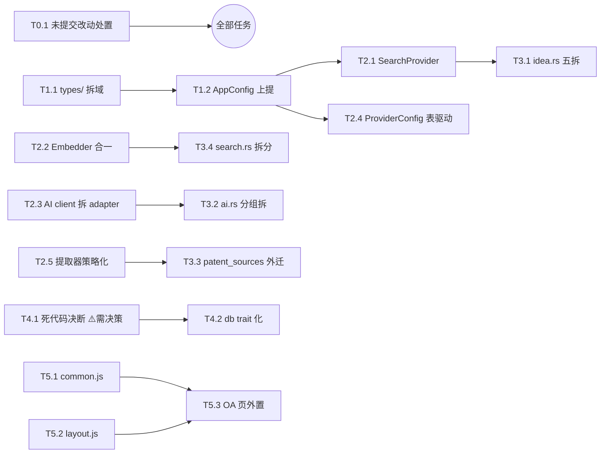

# 重构依赖图 / Dependency Graph

> 配套文档：task-breakdown.md / milestones.md

## 阶段级依赖（Mermaid）

```mermaid
graph TD
    subgraph 泳道A·后端主线
        P0[Phase 0 地基卫生<br/>T0.1-T0.5]
        P1[Phase 1 类型与错误地基<br/>T1.1-T1.5]
        P2[Phase 2 端口层建设<br/>T2.1-T2.5]
        P3[Phase 3 routes 巨型文件拆分<br/>T3.1-T3.6]
        P4[Phase 4 数据层与死代码<br/>T4.1-T4.4]
    end
    subgraph 泳道B·前端主线
        P5a[T5.1 共享JS层]
        P5b[T5.2 i18n减负]
        P5c[T5.3 OA页外置]
        P5d[T5.4 idea页外置]
        P5e[T5.5 innerHTML审计]
        P5f[T5.6 其余页面]
    end
    P6[Phase 6 收尾发布<br/>T6.1-T6.4]

    P0 --> P1
    P1 --> P2
    P2 --> P3
    P3 --> P4
    P0 -.->|T0.2 清理后开工| P5a
    P5a --> P5b
    P5b --> P5c
    P5b --> P5d
    P5a --> P5e
    P5c --> P5f
    P4 --> P6
    P5e --> P6
```

**关键并行关系**：泳道 A（src/）与泳道 B（templates/+static/）文件零交集，可双会话/双分支并行。合流点仅在 Phase 6。

## 任务级关键依赖



## 里程碑门禁

每个 Phase 结束时必须全绿：`cargo fmt --check` + `cargo clippy --all-targets -- -D warnings` + `cargo test`(159+) + `node check_html_functions.mjs` + `node e2e_test.mjs`(54+)。任一红 → 禁止进入下一阶段。

## 回滚策略

- 每任务独立 commit，秒级提交（防多会话互扫，遵守协作铁律）
- 每 Phase 结束打 tag：`refactor-p0`…`refactor-p6`
- 任何阶段可 `git reset --hard refactor-pN` 整体回退；DB 迁移链不动（本轮零 schema 变更）
