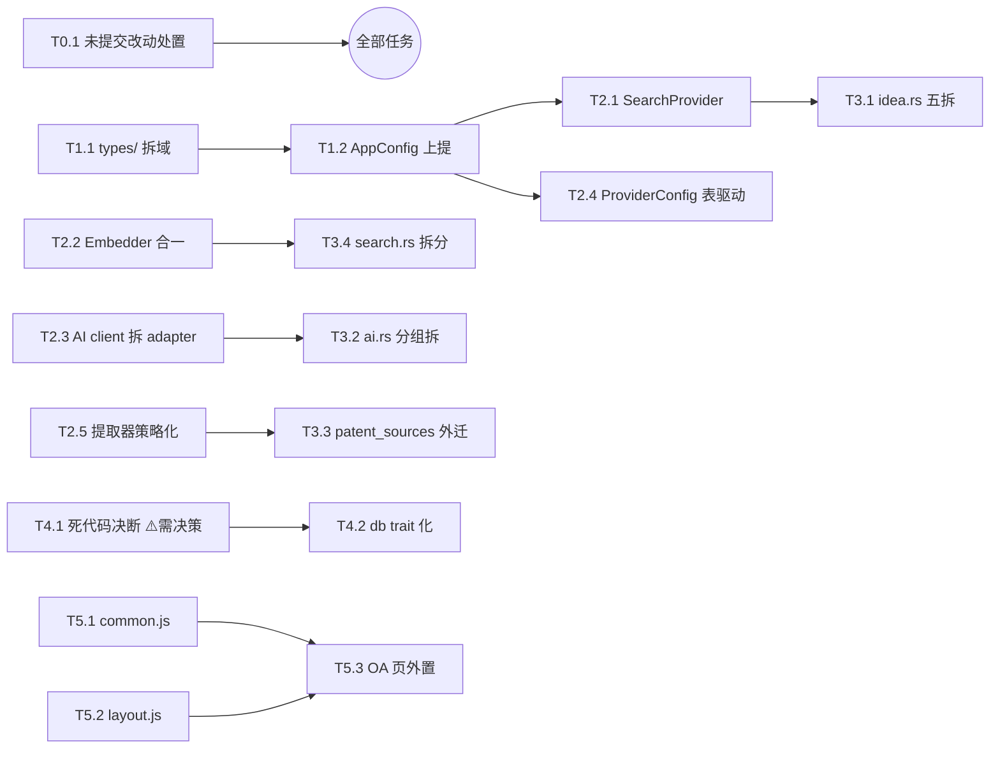
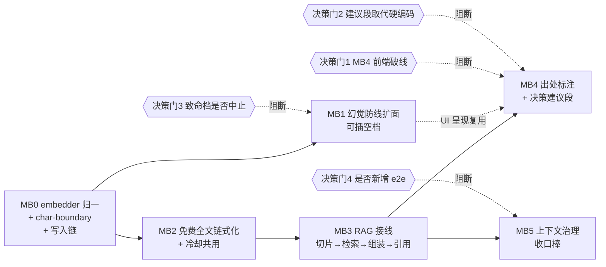

# 重构依赖图 / Dependency Graph

> 配套文档：task-breakdown.md / milestones.md

## 阶段级依赖（Mermaid）

```mermaid
graph TD
    subgraph 泳道A·后端主线
        P0[Phase 0 地基卫生<br/>T0.1-T0.5]
        P1[Phase 1 类型与错误地基<br/>T1.1-T1.5]
        P2[Phase 2 端口层建设<br/>T2.1-T2.5]
        P3[Phase 3 routes 巨型文件拆分<br/>T3.1-T3.6]
        P4[Phase 4 数据层与死代码<br/>T4.1-T4.4]
    end
    subgraph 泳道B·前端主线
        P5a[T5.1 共享JS层]
        P5b[T5.2 i18n减负]
        P5c[T5.3 OA页外置]
        P5d[T5.4 idea页外置]
        P5e[T5.5 innerHTML审计]
        P5f[T5.6 其余页面]
    end
    P6[Phase 6 收尾发布<br/>T6.1-T6.4]

    P0 --> P1
    P1 --> P2
    P2 --> P3
    P3 --> P4
    P0 -.->|T0.2 清理后开工| P5a
    P5a --> P5b
    P5b --> P5c
    P5b --> P5d
    P5a --> P5e
    P5c --> P5f
    P4 --> P6
    P5e --> P6
```

**关键并行关系**：泳道 A（src/）与泳道 B（templates/+static/）文件零交集，可双会话/双分支并行。合流点仅在 Phase 6。

## 任务级关键依赖

```mermaid
graph LR
    T01[T0.1 未提交改动处置] --> ALL((全部任务))
    T11[T1.1 types/ 拆域] --> T12[T1.2 AppConfig 上提]
    T12 --> T21[T2.1 SearchProvider]
    T12 --> T24[T2.4 ProviderConfig 表驱动]
    T21 --> T31[T3.1 idea.rs 五拆]
    T22[T2.2 Embedder 合一] --> T34[T3.4 search.rs 拆分]
    T23[T2.3 AI client 拆 adapter] --> T32[T3.2 ai.rs 分组拆]
    T25[T2.5 提取器策略化] --> T33[T3.3 patent_sources 外迁]
    T41[T4.1 死代码决断 ⚠️需决策] --> T42[T4.2 db trait 化]
    T51[T5.1 common.js] --> T53[T5.3 OA 页外置]
    T52[T5.2 layout.js] --> T53
```

## 里程碑门禁

每个 Phase 结束时必须全绿：`cargo fmt --check` + `cargo clippy --all-targets -- -D warnings` + `cargo test`(159+) + `node check_html_functions.mjs` + `node e2e_test.mjs`(54+)。任一红 → 禁止进入下一阶段。

> **数字陈旧提示（2026-09-28 校正）**：上行的 `159+` / `54+` 是重构轨历史水位，现网实测为 **`cargo test` 744 passed（lib 347 + bin 348 + 集成 49，MB0 合并后基线）** 与 **`node e2e_test.mjs` 60/60**（`expectedPasses=60`，MA6b 起）。以 `docs/plan/2026-09-28-mb-construction-spec.md` §3.1 的对账口径为准，禁止引用旧数字报进度。
> **编号撞车提示**：本文件与 `milestones.md` 的 `M0–M5` 属**重构轨**（Phase 0-6），与产品轨的 `M-A / M-B / M-C`（`task-breakdown.md`）不是同一套编号；产品轨内部的 `MB0–MB5`（施工包）与 `task-breakdown.md` M-B 表的 `MB1–MB7`（原任务号）也**不一一对应**，映射见该表 §M-B 段首说明。跨文档引用时务必带轨名。

## M-B 施工包依赖与契约耦合（产品轨，2026-09-28 规格书派包基线）

```mermaid
graph LR
    MB0[MB0 embedder 归一<br/>+ char-boundary<br/>+ 写入链] --> MB2[MB2 免费全文链式化<br/>+ 冷却共用]
    MB2 --> MB3[MB3 RAG 接线<br/>切片→检索→组装→引用]
    MB3 --> MB4[MB4 出处标注<br/>+ 决策建议段]
    MB0 --> MB1[MB1 幻觉防线扩面<br/>可插空档]
    MB3 --> MB5[MB5 上下文治理<br/>收口棒]
    MB1 -.UI 呈现复用.-> MB4
    GATE1{{决策门1 MB4 前端破线}} -.阻断.-> MB4
    GATE2{{决策门2 建议段取代硬编码}} -.阻断.-> MB4
    GATE3{{决策门3 致命档是否中止}} -.阻断.-> MB1
    GATE4{{决策门4 是否新增 e2e}} -.阻断.-> MB5
```

**为什么 MB2 必须先于 MB3**（不是「顺手排前」）：M-A 在线命中入库的专利 `description/claims` 恒为空（`google_patents_xhr.rs:498-500`、`epo_ops.rs:1021-1022`），MB3 要切全文就得先有全文；而唯一免费全文来源 `routes/patent.rs:221` 的 enrich-free 与 XHR **同 Host 却不查冷却表**——先接线后富化等于给熔断器开旁路。

**跨包契约（谁产谁消费，改协议必须同 PR 回写规格书 §5）**：

| 契约 | 生产者 | 消费者 | 破坏后果 |
|---|---|---|---|
| `reason_code` 枚举（`cooldown\|blocked\|timeout\|not_found\|parse_empty\|no_fulltext\|db_error\|already_enriched`） | MB2 定义并首发 | MB3⑥ 降级标注、MB4 报告文案、UI | 枚举混用 ⇒ 「没拿到」被呈现成「没有相关内容」，是 M-B 最严重的可信度缺陷 |
| `patent_chunks` 切片 id（`{patent_id}-{index}`）+ v21 表 | MB3① 写入 | MB3③ 反查、MB4① 出处 `source_id` | id 形态变 ⇒ MB4 的引用链悬空 |
| `RankedMatch.patent_id` | MB3② 新增 | MB3③ 检索、MB4 证据行 | 缺失 ⇒ MB3 验收「每条引用可反查」不成立（§1.6 h） |
| 向量单一出处 `compute_char_tfidf_embedding` | MB0 | MB3③ 切片相似度 | 出现第二套 ⇒ 写入/查询空间不一致（MB0 已消灭的问题回潮） |
| `fact_check` 结构化键 | MB1③ | MB4 渲染、UI | 仍走文本标记 ⇒ 违反 MA6b「只发键」纪律（§1.6 i） |
| 全表回填（**六包一律不做**） | — | — | 用户库 4.3GB，历史专利拿不到 embedding/chunks 是**已知缺口**，登记在规格书 §4.6，不靠临时脚本补 |

**并行禁止边**：MB0–MB5 六包**同仓禁止并行开两棒**（共享 `target/` 损坏 `incremental/` + D 盘余量仅 5.9GB）；`MB1` 的「可插空档」指串行空档，不是并发。

## 回滚策略

- 每任务独立 commit，秒级提交（防多会话互扫，遵守协作铁律）
- 每 Phase 结束打 tag：`refactor-p0`…`refactor-p6`
- 任何阶段可 `git reset --hard refactor-pN` 整体回退；DB 迁移链不动（本轮零 schema 变更）
